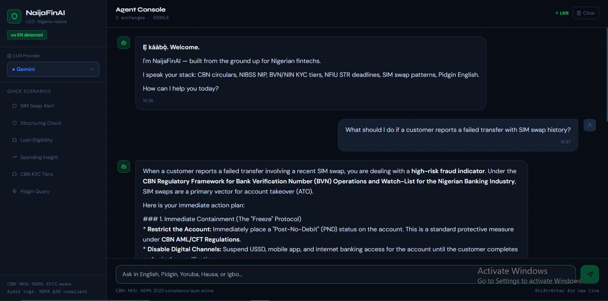

# 🇳🇬 NaijaFinAI — Production AI Agent for Nigerian Fintechs

> The only AI agent built natively for the Nigerian payments ecosystem — not a global tool with a Nigerian skin.

---

## What Makes This Different

Most fintech AI tools treat Nigeria as an afterthought. NaijaFinAI is built from the inside out:

| Capability | Generic Tools | NaijaFinAI |
|---|---|---|
| Fraud signals | Generic velocity checks | SIM swap (MTN/Airtel/Glo/9mobile patterns), NIN-BVN mismatch, USSD structuring, agent network mule chains |
| Regulatory citations | None | Specific CBN circulars, NFIU STR/CTR deadlines, EFCC referral thresholds |
| Language | English only | English + Pidgin + Yoruba + Hausa + Igbo routing |
| Compliance | No audit trail | NDPA 2023 §40 audit logs, PII scrubbing before LLM calls, NFIU filing reminders |
| Credit scoring | Generic DTI | CRC/FirstCentral bureau bands, CBN KYC tier loan limits, FCCPC concurrent loan rules |
| Currency | USD-first | NGN-first, ₦ formatting, Naira inflation-aware spending tips |

---

## Core Differentiators

### 1. Nigerian Fraud Intelligence Engine (`nigeria_intelligence.py`)
12 Nigerian-specific fraud signals, each with:
- Precise CBN/EFCC/NFIU regulatory citation
- Heuristic score delta calibrated to local patterns
- Recommended action (including STR/CTR filing where required)

Signals include:
- `SIM_SWAP_HIGH_VALUE_USSD` — USSD transfers within 48h of SIM replacement
- `CBN_STRUCTURING` — amounts in the ₦900k–₦999k zone (CTR avoidance)
- `NIN_BVN_MISMATCH` — strongest synthetic identity indicator in Nigeria
- `ROUND_TRIP_TRANSFER` — layering detection for AML
- `AGENT_VELOCITY_SPIKE` — mule chains through OPay/Moniepoint agent networks
- `FIRST_PARTY_FRAUD_LOAN` — loan disbursement + immediate full withdrawal pattern

### 2. NDPA/CBN Compliance Engine (`compliance.py`)
- **Audit log** generated for every AI decision (NDPA 2023 automated decision-making requirement)
- **PII scrubbing** before sending any data to external LLM APIs (CBN data residency)
- **Regulatory filing tracker** — tells you exactly which NFIU/EFCC/NDPC forms to file and when
- **5-year retention** timestamps per CBN AML record-keeping requirement

### 3. Nigerian Language Intelligence (`language.py`)
- Detects Pidgin, Yoruba, Hausa, Igbo, Nigerian English
- Dynamically adjusts agent response tone and language
- Pidgin financial glossary: "dem chop my money" → unauthorized debit, "e no enter" → failed transfer
- No global AI tool handles Nigerian code-switching

### 4. Multi-Provider LLM
Switch between OpenAI, Anthropic, Google, and Groq per request — no vendor lock-in.

---

## Architecture

```
naija-fintech-agent/
├── backend/
│   ├── app/
│   │   ├── core/
│   │   │   ├── nigeria_intelligence.py   ← 12 Nigerian fraud signals + CBN refs
│   │   │   ├── compliance.py             ← NDPA audit logs + NFIU filing tracker
│   │   │   ├── language.py               ← Pidgin/Yoruba/Hausa/Igbo detection
│   │   │   ├── llm_factory.py            ← Multi-provider LLM factory
│   │   │   ├── prompts.py                ← Nigeria-specialized system prompts
│   │   │   └── config.py
│   │   ├── tools/
│   │   │   └── fintech_tools.py          ← 3 LangChain tools (fraud, loans, insights)
│   │   ├── agents/
│   │   │   └── fintech_agent.py          ← Orchestrator + streaming + audit
│   │   ├── routers/
│   │   │   ├── chat.py                   ← /api/chat (streaming SSE)
│   │   │   ├── fraud.py                  ← /api/fraud/analyze
│   │   │   ├── loans.py                  ← /api/loans/eligibility
│   │   │   └── transactions.py           ← /api/transactions/insights
│   │   └── models/schemas.py
│   ├── main.py
│   └── requirements.txt
├── frontend/
│   └── src/
│       ├── App.jsx                       ← Split-pane layout (sidebar + chat)
│       ├── components/
│       │   ├── ChatMessage.jsx           ← Risk-colored bubbles + audit ID
│       │   ├── Sidebar.jsx               ← Provider selector + quick scenarios
│       │   └── ToolCallBanner.jsx        ← Shows which tools were invoked
│       ├── hooks/useChat.js              ← Streaming chat state
│       └── utils/api.js
└── docker-compose.yml
```

---

## API Endpoints

| Method | Endpoint | Description |
|---|---|---|
| `POST` | `/api/chat` | Multi-turn agent (streaming SSE) |
| `POST` | `/api/fraud/analyze` | Full fraud analysis with CBN refs + NFIU filing requirements |
| `POST` | `/api/loans/eligibility` | CBN-compliant loan assessment |
| `POST` | `/api/transactions/insights` | Nigerian spending analytics |
| `GET` | `/api/providers` | Available LLM providers |
| `GET` | `/api/health` | Health check |

## Provider Setup

The frontend lets you switch providers in the sidebar. Make sure to choose your provider in the web UI before sending the first message.

Update `.env` to match the provider you want to test:

- `DEFAULT_LLM_PROVIDER=openai`
- `DEFAULT_LLM_PROVIDER=anthropic`
- `DEFAULT_LLM_PROVIDER=google`
- `DEFAULT_LLM_PROVIDER=groq`

For free testing, `groq` or `google` are the recommended providers. Make sure the corresponding key is set in `.env` and the provider matches the selected sidebar option.

---

## Quickstart

```bash
git clone https://github.com/HenryMorganDibie/naija-fintech-agent.git
cd naija-fintech-agent
cp .env.example .env   # add your API keys
```

### Run with Docker Compose

```bash
docker compose up --build
```

Then open `http://localhost`

### Run locally without Docker

```bash
# Backend
cd backend && pip install -r requirements.txt
uvicorn main:app --reload --port 8000

# Frontend (new terminal)
cd frontend && npm install && npm run dev
```

Open [http://localhost:5173](http://localhost:5173)

## Screenshot Example

Below is a sample chat screenshot for the agent console. The image is stored in `docs/chat-example.png`.



> Tip: If you want to replace the screenshot later, keep the filename `docs/chat-example.png` so the README link stays valid.

---

## Author

**Henry Dibie** — ML/Data Engineer  
[LinkedIn](https://linkedin.com/in/kinghenrymorgan) · [GitHub](https://github.com/HenryMorganDibie)
