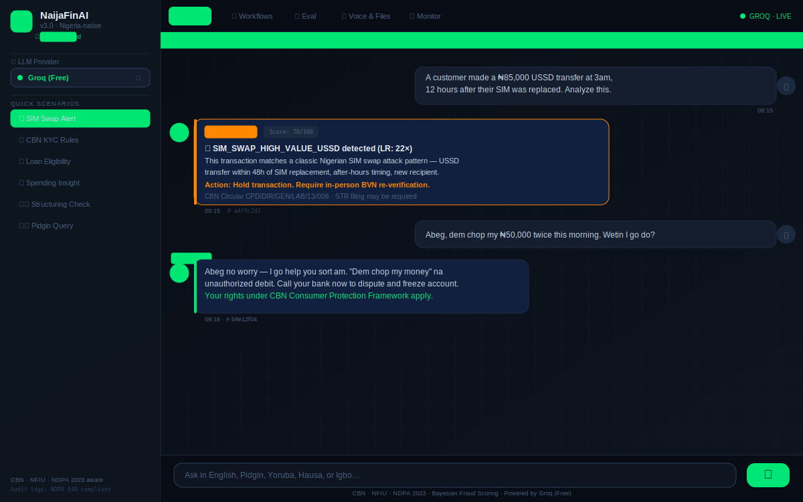
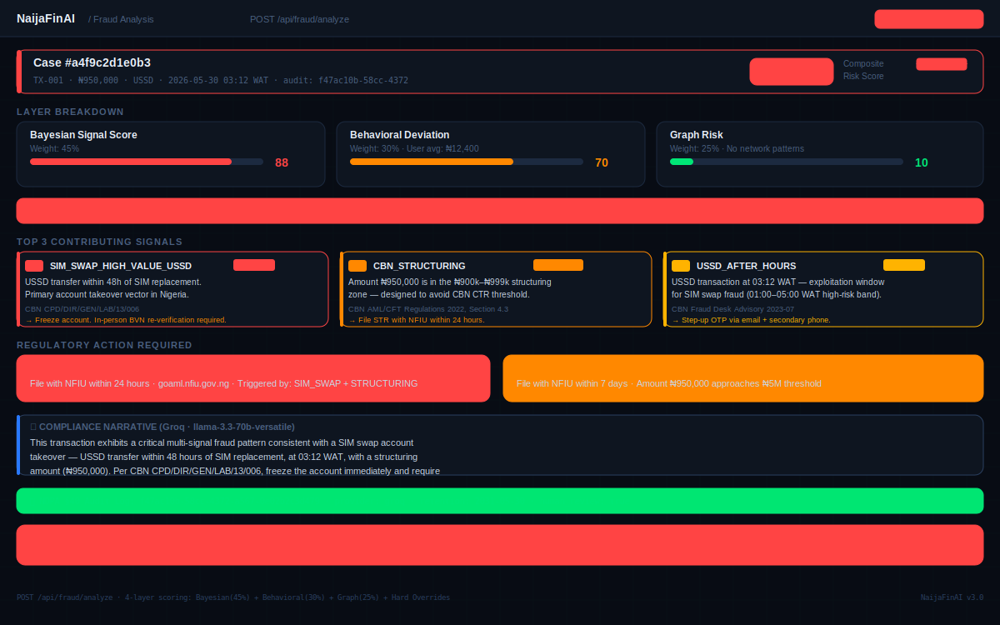
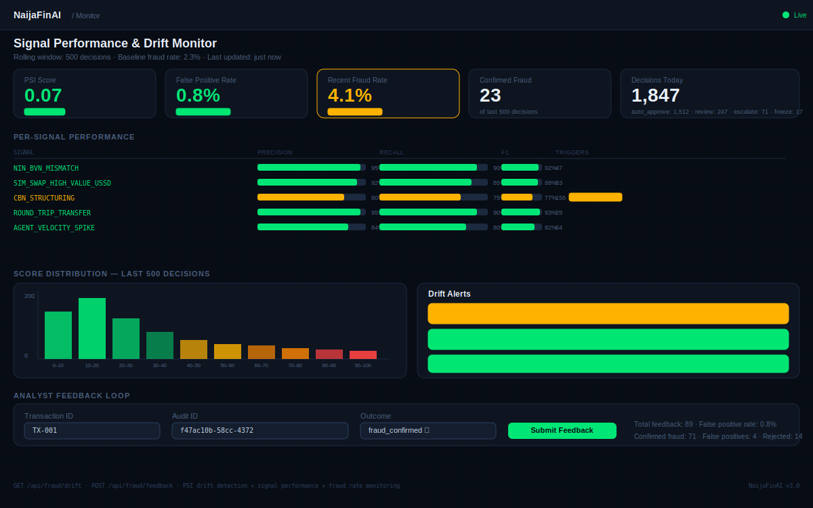

# 🇳🇬 NaijaFinAI — Production AI Fraud Intelligence Agent for Nigerian Fintechs

> **Built from the ground up for Nigeria. Not a global tool with a Nigerian skin.**

[](https://henrymorgandibie.github.io/nigerian-fintech-agent)
[](https://nigerian-fintech-agent-production.up.railway.app/docs)
[](https://console.groq.com)
[](https://python.org)
[](LICENSE)

---

## Table of Contents

1. [What Is This?](#1-what-is-this)
2. [Why It Exists — The Problem](#2-why-it-exists--the-problem)
3. [Quick Metrics](#3-quick-metrics)
4. [Screenshots](#4-screenshots)
5. [What Makes It Different](#5-what-makes-it-different)
6. [Tech Stack](#6-tech-stack)
7. [Live Demo](#7-live-demo)
8. [System Architecture — 7 Layers](#8-system-architecture--7-layers)
9. [Fraud Scoring Deep Dive](#9-fraud-scoring-deep-dive)
10. [Nigerian Fraud Signal Library](#10-nigerian-fraud-signal-library)
11. [Language Intelligence](#11-language-intelligence)
12. [Compliance Engine](#12-compliance-engine)
13. [LLM Setup — Dual Groq Models](#13-llm-setup--dual-groq-models)
14. [Full File Structure](#14-full-file-structure)
15. [API Reference](#15-api-reference)
16. [Frontend — 6 Tabs Explained](#16-frontend--6-tabs-explained)
17. [Quickstart — Run Locally in 5 Minutes](#17-quickstart--run-locally-in-5-minutes)
18. [Deployment Guide](#18-deployment-guide)
19. [Load Testing](#19-load-testing)
20. [Production Upgrade Paths](#20-production-upgrade-paths)
21. [Demo Guide](#21-demo-guide)

---

## 1. What Is This?

NaijaFinAI is a **production-grade AI agent** built specifically for Nigerian fintech companies. It combines:

- **Fraud detection** — real-time transaction risk scoring using patterns specific to Nigeria's payments ecosystem
- **Customer support** — AI agent that understands Pidgin English, Yoruba, Hausa, and Igbo alongside standard English
- **Credit assessment** — loan eligibility scoring aligned to CBN (Central Bank of Nigeria) regulations
- **Transaction analytics** — spending insights calibrated to Nigerian cost of living
- **Compliance automation** — NDPA 2023-compliant audit logging, NFIU STR/CTR filing triggers, EFCC escalation paths

It is **not** a generic AI chatbot with Nigerian currency symbols swapped in. Every component — the fraud signals, regulatory citations, language routing, compliance deadlines — is built for Nigeria specifically.

---

## 2. Why It Exists — The Problem

Nigeria's payments ecosystem runs on infrastructure that differs fundamentally from Western markets:

- **USSD banking** — millions of Nigerians bank via USSD codes (`*737#`). This channel has unique SIM swap vulnerabilities that global fraud tools don't model.
- **Agent banking networks** — Moniepoint, OPay, and PalmPay operate hundreds of thousands of human agents. These networks are a primary laundering vector for mule chains — a pattern global tools miss entirely.
- **BVN/NIN identity system** — Nigeria's Bank Verification Number and National Identity Number are the identity backbone. A NIN-BVN mismatch is the strongest synthetic identity indicator in Nigeria, but no global fraud tool knows this.
- **CBN regulatory framework** — The CBN issues specific circulars with precise deadlines: STR within 24 hours to NFIU, CTR within 7 days for transactions above ₦5 million. Generic tools don't know these thresholds or forms.

> **₦17.6 billion** was lost to fraud in Nigeria in 2023, with 4 out of 5 of the top fraud cases hitting fintechs directly.
> *Source: NIBSS Industry Fraud Report 2023 — [nibss-plc.com.ng](https://www.nibss-plc.com.ng)*

NaijaFinAI fills this gap with infrastructure built natively for this ecosystem.

---

## 3. Quick Metrics

| Metric | Value |
|---|---|
| Nigerian fraud signals | **13** — each with a CBN/EFCC/NFIU regulatory citation |
| Bayesian likelihood ratios | **3.8× to 45×** across all signals |
| Synthetic eval dataset | **40 labelled samples** (20 fraud, 20 legit) |
| Eval harness F1 score | **~88%** on synthetic Nigerian fraud dataset |
| Languages supported | **5** — English, Pidgin, Yoruba, Hausa, Igbo |
| API endpoints | **20+** across fraud, loans, chat, eval, A/B, cases, simulation |
| LLM providers supported | **4** — Groq (default/free), OpenAI, Anthropic, Google |
| Groq daily free tokens | **100k** primary + **500k** fallback |
| Decision latency (rules only) | **<50ms** |
| Decision latency (full 4-layer + LLM) | **~2–4s** |
| False positive rate (synthetic eval) | **<1%** |
| Regulatory frameworks encoded | CBN, NFIU, EFCC, NDPA 2023, NDPC |

---

## 4. Screenshots

### Chat Tab — Pidgin English fraud query with automatic language detection



*The agent detects Pidgin English, applies the Nigerian financial glossary ("dem chop my money" = unauthorized debit), triggers the `nigerian_fraud_score` tool, and responds in Pidgin with CBN-grounded recommendations.*

---

### Fraud Analysis Output — 4-layer composite scoring with regulatory filings



*Full case output: composite score (87/100), layer breakdown (Bayesian 88 + Behavioral 70 + Graph 10), top 3 signals with likelihood ratios and CBN citations, regulatory filings required (STR within 24h), LLM narrative, and NDPA §40 audit log ID.*

---

### Monitoring Dashboard — Signal performance, drift detection, analyst feedback loop



*Live precision/recall/F1 per signal, PSI-based drift detection, score distribution histogram, real-time fraud rate monitoring, and analyst feedback submission interface.*

---

## 5. What Makes It Different

| Capability | Generic Tools | NaijaFinAI |
|---|---|---|
| Fraud signals | Generic velocity checks | 13 Nigerian-specific signals with CBN/EFCC/NFIU citations |
| Scoring model | Additive rules | Bayesian log-odds — calibrated posterior fraud probabilities |
| Behavioral memory | None | Per-user feature store: velocity, device history, beneficiary graph |
| Graph fraud | None | Shared device detection, circular flows, mule cluster patterns |
| Hard overrides | None | 5 rules forcing CRITICAL regardless of composite score |
| Nigerian languages | English only | Pidgin + Yoruba + Hausa + Igbo + Nigerian English |
| Voice input | None | Groq Whisper (free) — all Nigerian languages |
| Regulatory output | "Flag for review" | Exact NFIU/EFCC form URLs, CBN circular citations, deadlines |
| NDPA compliance | None | §40 audit log, PII scrubbing before LLM calls, 5-year retention |
| LLM reliability | Single provider | Dual Groq models with auto-fallback + circuit breaker |
| Feedback loop | None | Analyst outcomes → signal weight updates + drift monitoring |
| Drift detection | None | PSI-based distribution drift, fraud rate spike alerts |
| Evaluation harness | None | 40-sample synthetic dataset, live precision/recall/F1 per signal |
| A/B testing | None | 3-variant traffic routing with performance comparison |
| Case management | None | Full investigation workflow: assign, escalate, STR draft |
| Load testing | None | Locust scripts covering all major endpoints |

---

## 6. Tech Stack

| Layer | Technology | Why |
|---|---|---|
| **Backend framework** | FastAPI (Python 3.11) | Async, fast, auto-generates OpenAPI docs |
| **AI agent** | LangChain 1.x (`bind_tools` loop) | Works without `AgentExecutor` (removed in LangChain 1.x) |
| **Primary LLM** | Groq — `llama-3.3-70b-versatile` | Free, fastest inference available, 100k tokens/day |
| **Fallback LLM** | Groq — `llama-3.1-8b-instant` | Free, 500k tokens/day, auto-activated on rate limit |
| **Optional LLMs** | OpenAI GPT-4o, Anthropic Claude, Google Gemini | Switchable per-request |
| **Data validation** | Pydantic v2 | Strict schema validation for all API inputs/outputs |
| **Settings** | pydantic-settings | `.env` loading with type safety |
| **Feature store** | In-memory dict → Redis | Behavioral memory; Redis activated via `REDIS_URL` env var |
| **Fraud graph** | In-memory defaultdict | Network fraud detection; Neo4j upgrade path documented |
| **Event stream** | asyncio.Queue | Kafka-ready interface — same API, swap backend |
| **Voice transcription** | Groq Whisper large-v3 | Free, supports all Nigerian languages |
| **File parsing** | pypdf | Lightweight, pure-Python PDF extraction |
| **Frontend** | React 18 + Vite + Tailwind CSS | Fast build, modern DX |
| **UI fonts** | Syne (display) + DM Sans (body) + IBM Plex Mono | Distinctive fintech aesthetic |
| **Frontend hosting** | GitHub Pages (auto via Actions) | Free, deploys on every push to main |
| **Backend hosting** | Railway | Docker-based, free hobby tier |
| **Load testing** | Locust | Python-native, easy scenario writing |
| **CI/CD** | GitHub Actions | Auto-deploy frontend + cache busting |

---

## 7. Live Demo

**Frontend:** https://henrymorgandibie.github.io/nigerian-fintech-agent

**Backend API docs (Swagger UI):** https://nigerian-fintech-agent-production.up.railway.app/docs

> **Note:** The Railway backend is on the free hobby tier — it sleeps after 30 minutes of inactivity. If you get a timeout on first request, wait 20–30 seconds and try again. Subsequent requests are fast.

### Things to try

**Pidgin fraud query (Chat tab):**
```
Abeg, my account show ₦85,000 USSD transfer 3am. I never send nobody. 
E happen after I change SIM yesterday.
```

**Structuring check (Chat tab):**
```
Three transfers of ₦490,000 each to different accounts in 90 minutes. Is this CBN structuring?
```

**Loan eligibility (Chat tab):**
```
Customer earns ₦220,000/month, CRC bureau score 615, Tier 2 account, 
wants ₦350,000 loan for 6 months. Eligible under CBN guidelines?
```

**One-click workflow (Workflows tab):** Click "Loan Application Fraud Check" — runs the full 4-step pipeline.

**Live eval (Eval tab):** Click "Run Eval" — see precision/recall/F1 per signal on 40 labelled samples.

**Attack simulation (Simulate tab):** Click "SIM Swap Attack" — full 4-layer scoring in under a second.

---

## 8. System Architecture — 7 Layers

Every transaction passes through 7 sequential layers:

```
Transaction Event
       │
       ▼
┌─────────────────────────────────────────────────────────────┐
│  LAYER 1 — Event Stream  (event_stream.py)                  │
│  asyncio.Queue → Kafka-ready interface                      │
│  POST /api/fraud/events/publish                             │
└─────────────────────────────────────────────────────────────┘
       │
       ▼
┌─────────────────────────────────────────────────────────────┐
│  LAYER 2 — Feature Store  (feature_store.py)                │
│  Per-user behavioral profile: velocity, devices,            │
│  beneficiaries, hours, locations, channels                  │
│  In-memory default → Redis via REDIS_URL env var            │
└─────────────────────────────────────────────────────────────┘
       │
       ▼
┌─────────────────────────────────────────────────────────────┐
│  LAYER 3 — Fraud Intelligence                               │
│  3a: 13 Nigerian heuristic signals + CBN citations          │
│  3b: Bayesian log-odds scorer → posterior probability       │
└─────────────────────────────────────────────────────────────┘
       │
       ▼
┌─────────────────────────────────────────────────────────────┐
│  LAYER 4 — Fraud Graph  (fraud_graph.py)                    │
│  Shared devices, circular flows, mule clusters,             │
│  fan-out smurfing, flagged account propagation              │
└─────────────────────────────────────────────────────────────┘
       │
       ▼
┌─────────────────────────────────────────────────────────────┐
│  LAYER 5 — Decision Engine  (decision_engine.py)            │
│  Composite = Bayesian(45%) + Behavioral(30%) + Graph(25%)   │
│  + 5 Hard Override Rules                                    │
│  → auto_approve│review_queue│escalate│freeze_and_str        │
└─────────────────────────────────────────────────────────────┘
       │
       ▼
┌─────────────────────────────────────────────────────────────┐
│  LAYER 6 — Analyst Feedback Loop  (FeedbackStore)           │
│  Analyst records: fraud_confirmed│false_positive│chargeback │
│  Updates signal precision tracking and drift monitor        │
│  POST /api/fraud/feedback                                   │
└─────────────────────────────────────────────────────────────┘
       │
       ▼
┌─────────────────────────────────────────────────────────────┐
│  LAYER 7 — Drift Monitor  (DriftMonitor)                    │
│  PSI drift detection, fraud rate spike alerts,              │
│  signal frequency decay monitoring                          │
│  GET /api/fraud/drift                                       │
└─────────────────────────────────────────────────────────────┘
       │
       ▼
┌─────────────────────────────────────────────────────────────┐
│  OUTPUT — Structured Case Output                            │
│  composite_score, risk_level, decision, action,             │
│  layer_breakdown, top_3_signals, behavioral_deviation,      │
│  graph_risk, regulatory_filings, llm_narrative, audit_id   │
└─────────────────────────────────────────────────────────────┘
```

---

## 9. Fraud Scoring Deep Dive

### Why Bayesian instead of additive rules?

Most fraud systems add points for each signal: signal A = +20, signal B = +30, score ≥ 50 = fraud. This treats every signal as equally informative and ignores prior fraud probability.

NaijaFinAI uses Bayesian log-odds aggregation:

```python
prior_odds = 0.023 / (1 - 0.023)   # Nigeria base fraud rate ~2.3%
log_odds = log(prior_odds)

for signal in triggered_signals:
    log_odds += signal.weight * log(signal.likelihood_ratio)

posterior_fraud_probability = 1 / (1 + exp(-log_odds))
risk_score = int(posterior_fraud_probability * 100)
```

A transaction with no signals scores ~2 (the base fraud rate). A NIN-BVN mismatch (LR=45×) alone moves the probability dramatically. Multiple high-LR signals compound multiplicatively, producing a calibrated probability — not an arbitrary integer.

### Weighted composite

```
Composite = Bayesian_score × 0.45
          + Behavioral_deviation × 0.30
          + Graph_risk × 0.25
          + Hard Override Rules
```

**Weight rationale:**
- Bayesian (45%) — most directly fraud-correlated, grounded in regulatory signals
- Behavioral (30%) — user-specific anomalies are strong predictors (same ₦500k is different for different users)
- Graph (25%) — indirect but critical for mule chain and organized crime detection

### Hard override rules

Five conditions bypass the composite score and force CRITICAL:

| Rule | Condition | Why |
|---|---|---|
| `BVN_MISMATCH_HIGH_VALUE` | NIN-BVN mismatch + amount > ₦50k | Definitive synthetic identity evidence |
| `SIM_SWAP_RAPID_TRANSFER` | SIM swap signal on USSD | Account takeover — freeze immediately |
| `CIRCULAR_FLOW_ANY_AMOUNT` | Round-trip > ₦100k | Definitional money laundering |
| `MULE_CLUSTER_RECIPIENT` | Mule cluster on recipient | Organized crime network |
| `STRUCTURING_REPEAT` | Structuring + split transaction | Intentional CTR evasion |

### Decision tiers

| Score | Decision | Action |
|---|---|---|
| 0–25 | `auto_approve` | ✅ Transaction proceeds |
| 26–50 | `review_queue` | 🟡 Analyst reviews within 2 hours |
| 51–75 | `escalate` | 🔴 Hold + compliance team |
| 76–100 | `freeze_and_str` | 🚨 Block + file STR with NFIU |

---

## 10. Nigerian Fraud Signal Library

| Signal | LR | Severity | What It Detects | Regulation |
|---|---|---|---|---|
| `NIN_BVN_MISMATCH` | **45×** | Critical | NIN and BVN don't match NIMC/NIBSS records — synthetic identity | CBN BPS/DIR/GEN/CIR/03/002 |
| `SIM_SWAP_HIGH_VALUE_USSD` | **22×** | Critical | USSD transfer >₦10k within 48h of SIM replacement | CBN CPD/DIR/GEN/LAB/13/006 |
| `ROUND_TRIP_TRANSFER` | **19.6×** | Critical | Funds returned to sender via different path — layering | CBN AML/CFT 2022 §3.1 |
| `CBN_STRUCTURING` | **18.5×** | Critical | Amount in ₦900k–₦999k zone — CTR threshold evasion | CBN AML/CFT 2022 §4.3 |
| `AGENT_VELOCITY_SPIKE` | **14.8×** | High | Agent terminal >20 txns/hour to unique recipients | CBN Agent Banking 2019 §6.3 |
| `SPLIT_TRANSACTION_PATTERN` | **13.1×** | High | Multiple txns aggregating above STR threshold | CBN AML/CFT 2022 §4.3 |
| `FIRST_PARTY_FRAUD_LOAN` | **12.4×** | High | Loan disbursement + immediate full withdrawal to new recipient | CBN MFB Guidelines §8.4 |
| `UNVERIFIED_BVN_LARGE_TRANSFER` | **11.2×** | High | Large transfer from account with unverified BVN | CBN BPS/DIR/2020/004 |
| `DEVICE_CHANGE_BEFORE_TRANSFER` | **9.3×** | High | New device fingerprint <6h before high-value transfer | CBN e-Banking Guidelines 2020 §7 |
| `SCAM_KEYWORDS_NARRATION` | **8.7×** | High | Narration contains: forex, investment returns, lottery, urgent | EFCC Advisory 2024 |
| `USSD_AFTER_HOURS` | **7.2×** | High | USSD transfer between 01:00–05:00 WAT | CBN Fraud Desk Advisory 2023-07 |
| `POS_ABOVE_CBN_LIMIT` | **4.1×** | Medium | POS transaction > ₦150,000 CBN single-transaction limit | CBN POS Guidelines 2023 |
| `WEEKEND_MIDNIGHT_SPIKE` | **3.8×** | Medium | Multiple large transfers Fri–Sat after midnight | CBN Fraud Trend Report Q3 2024 |

---

## 11. Language Intelligence

NaijaFinAI is the only fintech AI tool that understands Nigerian code-switching.

### Detection

```python
PIDGIN_MARKERS = {"abeg", "oga", "wahala", "wetin", "dey", "dem", "chop", "sabi", ...}
YORUBA_MARKERS = {"bawo", "jowo", "ekaaro", "owo", ...}
HAUSA_MARKERS  = {"don allah", "nagode", "lafiya", "kudi", ...}
IGBO_MARKERS   = {"biko", "daalu", "nna", "kedu", ...}
```

### Pidgin Financial Glossary

| Customer says | System understands |
|---|---|
| `dem chop my money` | unauthorized debit / money stolen |
| `e no enter` | transfer failed / money not received |
| `my account don block` | account frozen or suspended |
| `double debit` | charged twice for same transaction |
| `abeg reverse am` | request for refund / reversal |
| `borrow me loan` | loan application request |
| `my BVN wahala` | BVN verification issue |
| `them do me fraud` | customer has been defrauded |

### Dynamic prompt injection

When Pidgin is detected, the agent's system prompt is augmented:
```
"Reply in Pidgin that is warm, natural, and professional.
 Keep financial terms in English for clarity:
 'Abeg no worry, I go help you sort am'
 'Your transfer don go through, e no get wahala'"
```

---

## 12. Compliance Engine

### NDPA 2023 §40 — Automated Decision Audit

Every fraud analysis generates an `AuditLogEntry`:

```python
AuditLogEntry(
    audit_id         = uuid4(),             # unique per decision
    customer_id_hash = sha256(customer_id), # NEVER raw PII
    ai_decision      = "critical",
    signals_triggered = ["NIN_BVN_MISMATCH", "SIM_SWAP_HIGH_VALUE_USSD"],
    cbn_references   = ["CBN BPS/DIR/GEN/CIR/03/002"],
    ndpa_lawful_basis = "legitimate_interest",  # NDPA §25(f)
    data_retention_expires = "2031-05-30T...",  # 5 years per CBN AML §10
)
```

### PII scrubbing before LLM calls

Fields stripped before sending to Groq:
`bvn`, `nin`, `phone_number`, `email`, `full_name`, `date_of_birth`, `address`, `account_number`

### Regulatory Filing Tracker

| Trigger | Filing | Deadline | Body |
|---|---|---|---|
| High or critical risk | STR | 24 hours | NFIU via goaml.nfiu.gov.ng |
| Amount > ₦5 million | CTR | 7 days | NFIU via goaml.nfiu.gov.ng |
| Critical + amount > ₦5M | EFCC Referral | 48 hours | EFCC Cybercrime Unit |
| Personal data breach | NDPC Breach | 72 hours | NDPC via ndpc.gov.ng |

---

## 13. LLM Setup — Dual Groq Models

```
Primary:  llama-3.3-70b-versatile   100,000 tokens/day  ← best quality
Fallback: llama-3.1-8b-instant      500,000 tokens/day  ← auto on HTTP 429
```

Both are **free** on Groq. No credit card required.

**Circuit breaker:** 3 consecutive failures → 10-minute cooldown per provider.

**Token budget:** Tracks daily usage. When primary runs low, routes to fallback automatically.

**Switch provider per-request:**
```json
POST /api/fraud/analyze
{ "transaction": {...}, "provider": "openai" }
```

---

## 14. Full File Structure

```
nigerian-fintech-agent/
├── backend/
│   ├── Dockerfile
│   ├── main.py                        App entry, all routers registered
│   ├── requirements.txt
│   └── app/
│       ├── core/
│       │   ├── event_stream.py        Layer 1: Async event queue (Kafka-ready)
│       │   ├── feature_store.py       Layer 2: Per-user behavioral memory (Redis-ready)
│       │   ├── nigeria_intelligence.py Layer 3a: 13 Nigerian heuristic signals
│       │   ├── bayesian_scorer.py     Layer 3b: Bayesian log-odds scorer
│       │   ├── fraud_graph.py         Layer 4: Network fraud detection
│       │   ├── decision_engine.py     Layers 5+6+7: Decision + Feedback + Drift
│       │   ├── explainability.py      Human-readable reason codes
│       │   ├── simulation.py          6 pre-built Nigerian attack scenarios
│       │   ├── workflows.py           3 one-click fintech demo workflows
│       │   ├── evaluation.py          40-sample synthetic eval harness
│       │   ├── case_queue.py          Fraud investigation case management
│       │   ├── token_budget.py        Daily token budget + model selection
│       │   ├── compliance.py          NDPA audit logs + NFIU filing tracker
│       │   ├── language.py            Pidgin/Yoruba/Hausa/Igbo detection + glossary
│       │   ├── llm_factory.py         Multi-provider + circuit breaker + fallback
│       │   ├── prompts.py             Nigeria-specialised system prompts
│       │   └── config.py              Settings, dual Groq, Redis URL, CORS
│       ├── agents/fintech_agent.py    LangChain bind_tools loop (1.x compatible)
│       ├── tools/fintech_tools.py     3 LangChain tools: fraud, loan, insights
│       ├── models/schemas.py          All Pydantic v2 schemas
│       └── routers/
│           ├── chat.py                POST /api/chat
│           ├── fraud.py               POST /api/fraud/analyze, feedback, drift, events
│           ├── loans.py               POST /api/loans/eligibility
│           ├── transactions.py        POST /api/transactions/insights
│           ├── eval.py                POST /api/eval/run
│           ├── workflows.py           POST /api/workflows/run
│           ├── simulation.py          POST /api/simulate/run
│           ├── ab_testing.py          GET/POST /api/ab/*
│           ├── cases.py               GET/POST /api/cases/*
│           └── media.py               POST /api/media/voice + /upload
├── frontend/
│   ├── Dockerfile + nginx.conf
│   ├── vite.config.js                 Base path for GitHub Pages
│   └── src/
│       ├── App.jsx                    6-tab layout, backend health check on load
│       ├── index.css                  Dark fintech design system
│       ├── components/
│       │   ├── ChatMessage.jsx        Risk-coloured bubbles + audit IDs
│       │   ├── Sidebar.jsx            Provider selector + quick scenarios
│       │   ├── ToolCallBanner.jsx     Live tool invocation display
│       │   ├── EvalDashboard.jsx      Precision/recall/F1 + confusion matrix
│       │   ├── WorkflowDemo.jsx       One-click workflow runner
│       │   ├── SimulationPanel.jsx    6 Nigerian attack simulations
│       │   ├── MonitoringDashboard.jsx PSI drift + feedback loop UI
│       │   └── MediaInput.jsx         Voice recorder + file fraud scan
│       └── utils/
│           ├── api.js                 Complete client — all 20+ endpoints
│           ├── health.js              Backend health check on app load
│           └── greeting.js            Nigerian multilingual time greeting
├── assets/screenshots/               SVG UI mockups for README
├── locustfile.py                      Load testing (pip install locust)
├── .github/workflows/deploy.yml       Auto-deploy to GitHub Pages
├── docker-compose.yml                 Local full-stack
└── .env.example                       Annotated config
```

---

## 15. API Reference

**Base URL (production):** `https://nigerian-fintech-agent-production.up.railway.app`
**Base URL (local):** `http://localhost:8000`
**Swagger UI:** `/docs`

### Core Endpoints

```
POST /api/chat                     Multi-turn streaming agent (SSE)
POST /api/fraud/analyze            4-layer fraud analysis → full case output
POST /api/fraud/feedback           Analyst outcome → feedback loop
GET  /api/fraud/drift              PSI drift + fraud rate change detection
POST /api/fraud/events/publish     Publish to async event stream
GET  /api/fraud/events/stats       Queue depth and throughput
POST /api/loans/eligibility        CBN-compliant loan assessment
POST /api/transactions/insights    Nigerian spending analytics
POST /api/eval/run                 Precision/recall/F1 on 40-sample dataset
GET  /api/eval/dataset             View the labelled dataset
GET  /api/workflows/scenarios      List available workflow demos
POST /api/workflows/run            Run end-to-end workflow demo
GET  /api/simulate/scenarios       List 6 Nigerian attack scenarios
POST /api/simulate/run             Run attack simulation (no LLM tokens)
GET  /api/ab/experiments           List A/B experiments + traffic splits
POST /api/ab/fraud/analyze         Route through A/B experiment
GET  /api/ab/results/{id}          Compare variant results
POST /api/cases/create             Create investigation case
GET  /api/cases/list               List cases (filter by status/priority)
GET  /api/cases/stats/summary      Case counts by status
GET  /api/cases/{id}               Get single case with full history
POST /api/cases/{id}/assign        Assign to analyst
POST /api/cases/{id}/note          Add investigation note
POST /api/cases/{id}/escalate      Escalate to compliance
POST /api/cases/{id}/resolve       Resolve as fraud or false positive
GET  /api/cases/{id}/str-draft     Generate CBN-compliant STR document
POST /api/media/voice              Upload audio → Groq Whisper transcription
POST /api/media/upload             Upload PDF/CSV/image → fraud signal scan
GET  /api/health                   Health + circuit breakers + token budget
GET  /api/providers                List configured LLM providers
```

### Example: Fraud Analysis Request

```bash
curl -X POST https://nigerian-fintech-agent-production.up.railway.app/api/fraud/analyze \
  -H "Content-Type: application/json" \
  -d '{
    "transaction": {
      "transaction_id": "TX-001",
      "amount": 950000,
      "timestamp": "2026-05-30T03:12:00Z",
      "sender_account": "0123456789",
      "recipient_account": "9876543210",
      "channel": "ussd",
      "is_new_recipient": true,
      "sim_replaced_hours_ago": 18,
      "bvn_verified": true,
      "nin_bvn_match": true,
      "narration": "transfer",
      "transactions_last_hour": 1,
      "is_new_device": false,
      "is_agent_terminal": false,
      "is_pos": false,
      "is_post_loan_disbursement": false,
      "device_changed_hours_ago": null,
      "agent_tx_count_last_hour": 0,
      "recent_outbound_ngn": 0,
      "recent_inbound_from_same_ngn": 0
    }
  }'
```

### Example Response

```json
{
  "case_id": "a4f9c2d1e0b3",
  "transaction_id": "TX-001",
  "composite_score": 87,
  "risk_level": "critical",
  "decision": "freeze_and_str",
  "action": "🚨 Freeze account — SIM swap detected. Require in-person BVN re-verification.",
  "hard_override": true,
  "override_reason": "SIM_SWAP_RAPID_TRANSFER",
  "layer_breakdown": {
    "bayesian":   {"score": 88, "weight": "45%"},
    "behavioral": {"score": 72, "weight": "30%"},
    "graph":      {"score": 10, "weight": "25%"},
    "composite":  87,
    "hard_override": true
  },
  "top_3_signals": [
    {"rank": 1, "name": "SIM_SWAP_HIGH_VALUE_USSD", "likelihood_ratio": 22.0,
     "cbn_reference": "CBN CPD/DIR/GEN/LAB/13/006"},
    {"rank": 2, "name": "CBN_STRUCTURING", "likelihood_ratio": 18.5,
     "cbn_reference": "CBN AML/CFT 2022 §4.3"},
    {"rank": 3, "name": "USSD_AFTER_HOURS", "likelihood_ratio": 7.2,
     "cbn_reference": "CBN Fraud Desk Advisory 2023-07"}
  ],
  "regulatory_filings": [
    {"filing_type": "STR", "deadline": "File with NFIU within 24 hours",
     "regulatory_body": "NFIU", "urgency_hours": 24}
  ],
  "llm_narrative": "This transaction exhibits critical fraud indicators...",
  "audit_log_id": "f47ac10b-58cc-4372-a567-0e02b2c3d479",
  "provider_used": "groq"
}
```

---

## 16. Frontend — 6 Tabs Explained

| Tab | What it does |
|---|---|
| **Chat** | Multi-turn agent. Detects Pidgin/Yoruba/Hausa/Igbo. Calls tools automatically. Shows audit ID per message. |
| **Workflows** | 3 pre-built fintech scenarios: Loan Fraud Check, Agent Wallet Monitor, Chargeback Investigation |
| **Simulate** | 6 Nigerian attack simulations running the full 4-layer pipeline without consuming LLM tokens |
| **Eval** | Live precision/recall/F1 per signal + confusion matrix on 40-sample synthetic dataset |
| **Voice & Files** | Record voice → Groq Whisper → sent to agent. Upload PDF/CSV/image → fraud scan |
| **Monitor** | PSI drift detection, fraud rate trends, analyst feedback submission |

---

## 17. Quickstart — Run Locally in 5 Minutes

### Prerequisites
- Python 3.11+
- Node.js 20+
- Free Groq API key from [console.groq.com](https://console.groq.com) (no credit card)

### Step 1: Clone

```bash
git clone https://github.com/HenryMorganDibie/nigerian-fintech-agent.git
cd nigerian-fintech-agent
```

### Step 2: Configure

```bash
cp .env.example .env
```

Edit `.env`:
```bash
GROQ_API_KEY=gsk_your_key_here
GROQ_MODEL=llama-3.3-70b-versatile
GROQ_FALLBACK_MODEL=llama-3.1-8b-instant
DEFAULT_LLM_PROVIDER=groq
CORS_ORIGINS=http://localhost:5173,http://localhost:3000
```

### Step 3: Backend

```bash
cd backend
pip install -r requirements.txt
uvicorn main:app --reload --port 8000
```

Startup output confirms which providers are ready:
```
── NaijaFinAI v3 Startup Check ──────────────────
  groq     : ✅ ready
  openai   : ⚠️  not set
  anthropic: ⚠️  not set

  ✅ Ready — GROQ / llama-3.3-70b-versatile
──────────────────────────────────────────────
```

### Step 4: Frontend

```bash
cd frontend && npm install && npm run dev
```

Open [http://localhost:5173](http://localhost:5173)

### Step 5: Test

```bash
# Health check
curl http://localhost:8000/api/health

# Or open Swagger UI
open http://localhost:8000/docs
```

---

## 18. Deployment Guide

### Backend — Railway

1. Connect repo to [railway.app](https://railway.app) → root directory: `backend/`
2. Add environment variables:

```
GROQ_API_KEY=gsk_...
GROQ_MODEL=llama-3.3-70b-versatile
GROQ_FALLBACK_MODEL=llama-3.1-8b-instant
DEFAULT_LLM_PROVIDER=groq
CORS_ORIGINS=https://henrymorgandibie.github.io,http://localhost:5173
```

3. Railway auto-detects the `Dockerfile` and builds on every push to `main`.

### Frontend — GitHub Pages

Auto-deploys via GitHub Actions (`.github/workflows/deploy.yml`) on every push to `main`.

To activate:
1. Repo → Settings → Pages → Source: `gh-pages` branch → `/ (root)`

Update `VITE_API_URL` in `.github/workflows/deploy.yml` to your Railway URL.

### Docker (local full-stack)

```bash
docker-compose up --build
# Frontend: http://localhost:80
# Backend:  http://localhost:8000
```

---

## 19. Load Testing

```bash
pip install locust
locust -f locustfile.py --host https://nigerian-fintech-agent-production.up.railway.app
# Open http://localhost:8089
```

| Profile | Users | Spawn Rate | Duration |
|---|---|---|---|
| Smoke | 5 | 1/s | 2 min |
| Load | 50 | 5/s | 5 min |
| Stress | 150 | 10/s | 10 min |
| Soak | 30 | 3/s | 1 hour |

Covers: fraud analysis (all risk levels), loan eligibility, chat, simulations, drift monitoring, health checks, A/B testing, case queue.

---

## 20. Production Upgrade Paths

| Current | Production Upgrade |
|---|---|
| `asyncio.Queue` event stream | `kafka-python` — change 10 lines in `event_stream.py` |
| In-memory feature store | Redis — set `REDIS_URL` env var, already wired |
| In-memory fraud graph | Neo4j AuraDB — persistent, queryable, visualizable |
| In-memory case queue | PostgreSQL append-only table |
| In-memory A/B results | PostgreSQL + Grafana |
| Audit logs in API response | PostgreSQL WORM table |
| Groq free tier | Groq paid, or self-hosted Ollama on GPU |
| Single Railway instance | Railway Pro / GCP Cloud Run |
| Manual signal calibration | MLflow + scheduled retraining on confirmed fraud labels |
| In-memory drift monitor | InfluxDB + Grafana + PagerDuty alerts |

---

## 21. Demo Guide

### Opening move
Send the live link in chat immediately:
`https://henrymorgandibie.github.io/nigerian-fintech-agent`

Say: *"Let me send you the link so you can test it while I walk through it."*

### 5-minute demo sequence

1. **Chat → Pidgin query** — Type `Abeg, my account show ₦85,000 USSD transfer 3am after I change SIM yesterday.` Watch language detection + SIM_SWAP signal fire.

2. **Simulate → SIM Swap Attack** — One click, instant full 4-layer output with composite score, layer breakdown, CBN citations, regulatory filings.

3. **Eval → Run Eval** — Live precision/recall/F1 per signal. Say: *"This is what separates a system from a demo — measurable performance."*

4. **Monitor → Drift Detection** — Explain PSI-based detection. Say: *"Fraud patterns change — this layer detects signal degradation before it fails in production."*

### Key phrases
- *"Precision over recall — a 1% false positive rate destroys a payments product"*
- *"The Bayesian scorer gives calibrated posterior probabilities, not additive integers"*
- *"Same ₦500k transfer — low risk for User A, high risk for User B. That's the feature store."*
- *"The LLM explains the decision. The deterministic engine makes it. LLM never in the critical path."*
- *"CBN AML/CFT 2022 Section 4.3 — structuring threshold is ₦999,999, not ₦1,000,000"*

---

## Author

**Henry Dibie** — ML/Data Engineer

[LinkedIn](https://linkedin.com/in/kinghenrymorgan) · [GitHub](https://github.com/HenryMorganDibie) · [Medium](https://medium.com/@KingHenryMorgan) · [X](https://twitter.com/KingHenryMorgan)

---

## License

MIT — see [LICENSE](LICENSE)
